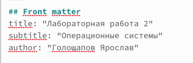
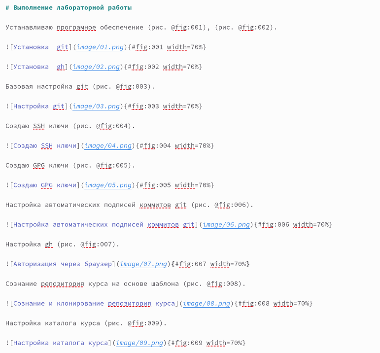
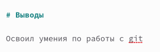
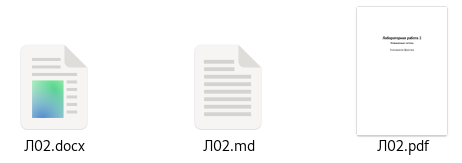

---
## Front matter
lang: ru-RU
title: Лабораторная работа 3
subtitle: Операционные системы
author:
  - Голощапов Ярослав

## i18n babel
babel-lang: russian
babel-otherlangs: english

## Formatting pdf
toc: false
toc-title: Содержание
slide_level: 2
aspectratio: 169
section-titles: true
theme: metropolis
header-includes:
 - \metroset{progressbar=frametitle,sectionpage=progressbar,numbering=fraction}
 - '\makeatletter'
 - '\beamer@ignorenonframefalse'
 - '\makeatother'
---

## Цели и задачи

- Научиться оформлять отчёты с помощью легковесного языка разметки Markdown
– Сделайте отчёт по предыдущей лабораторной работе в формате Markdown.
– В качестве отчёта просьба предоставить отчёты в 3 форматах: pdf, docx и md (в архиве,
поскольку он должен содержать скриншоты, Makefile и т.д.)

## Изучение шаблона отчета

Меняю название и автора отчета 

{#fig:001 width=70%}

## Основная часть

{#fig:002 width=70%}

## Вывод шаблона

Формулирую вывод

{#fig:003 width=70%}

## Отчеты

Формы отчетов

{#fig:004 width=70%}

## Вывод

Научился оформлять отчёты с помощью легковесного языка разметки Markdown

:::

